# Portal de Tareas con Autenticación JWT - .NET 8

Este proyecto consiste en una API RESTful desarrollada en ASP.NET Core 8 y un portal web MVC también en ASP.NET Core 8, que permite gestionar tareas con autenticación basada en JWT.

## 🔧 Tecnologías utilizadas
- ASP.NET Core 8 (API + MVC)
- Entity Framework Core
- SQL Server + Procedimientos almacenados
- Autenticación JWT
- Bootstrap 5
- Session para token JWT en el portal

## ▶️ Instrucciones de ejecución

1. Abrir la solución en Visual Studio 2022.
2. Restaurar paquetes NuGet automáticamente.
3. Ejecutar el script `GestorTareasDb.sql` en tu instancia de SQL Server.
4. Configurar la cadena de conexión en `appsettings.json` en proyecto GestorTareas.API.
    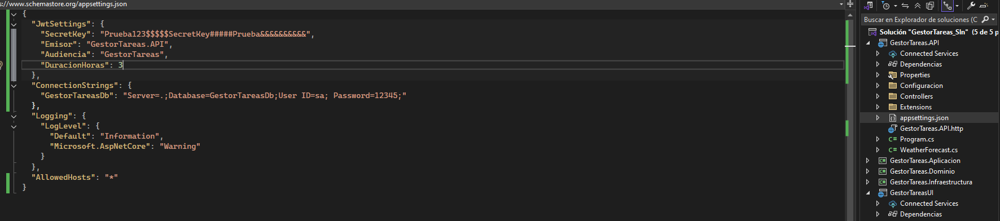
5. Configurar en `appsettings.json` en proyecto GestorTareasUI la url de la Api para que eista conexión entre el sitio y la Api.
      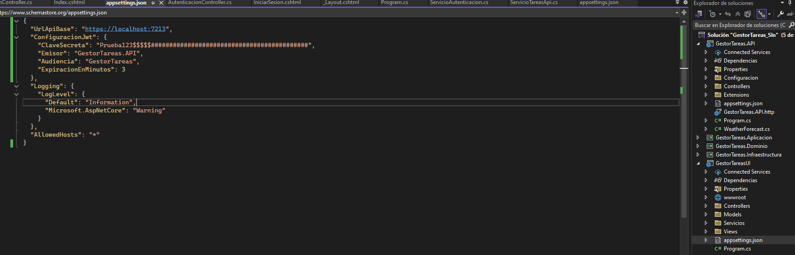
5. Establecer el proyecto de inicio (API o portal).
6. Iniciar sesión en el portal con: 
    Usuario:    juan.perez
	Contraseña: Prueba123
7. Capturas API en swagger:
    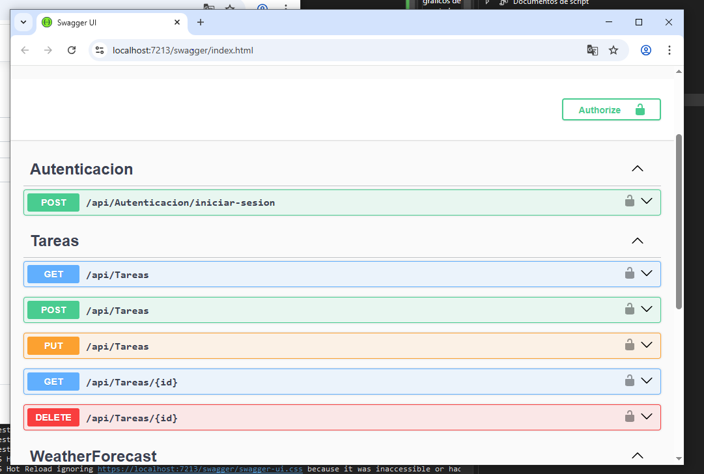
    Consumo de Api Iniciar sesión  generación de Token: 
    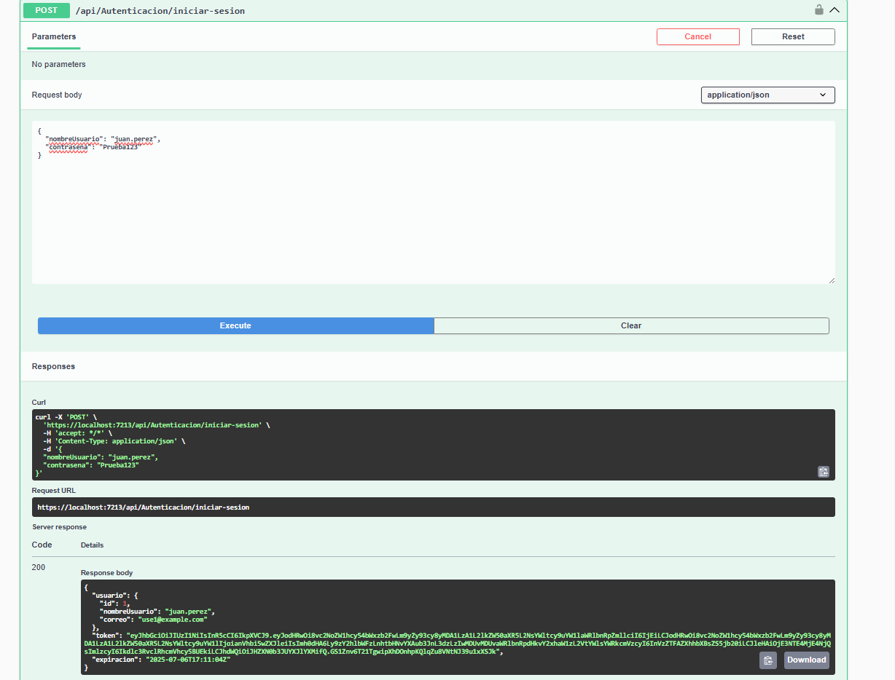
    Consumo de los demás métodos con el token generado:
        Agregando el Token: 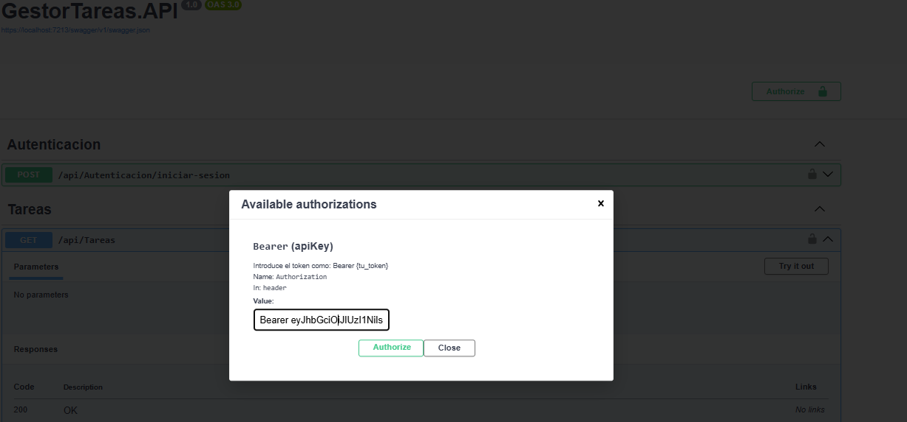
        Consumiento api para obtener todas las Tareas registradas: 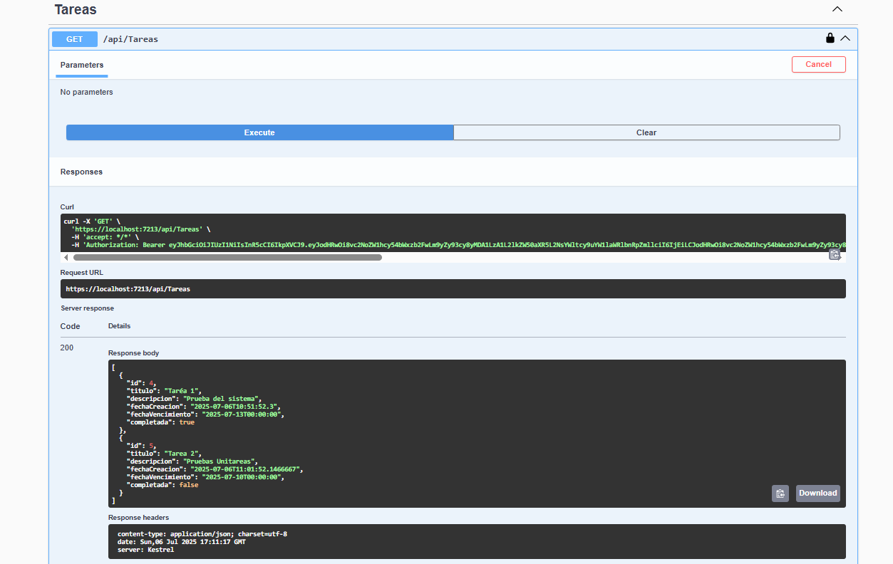
8. Capturas portal: 
    Inicio de sesión: 
      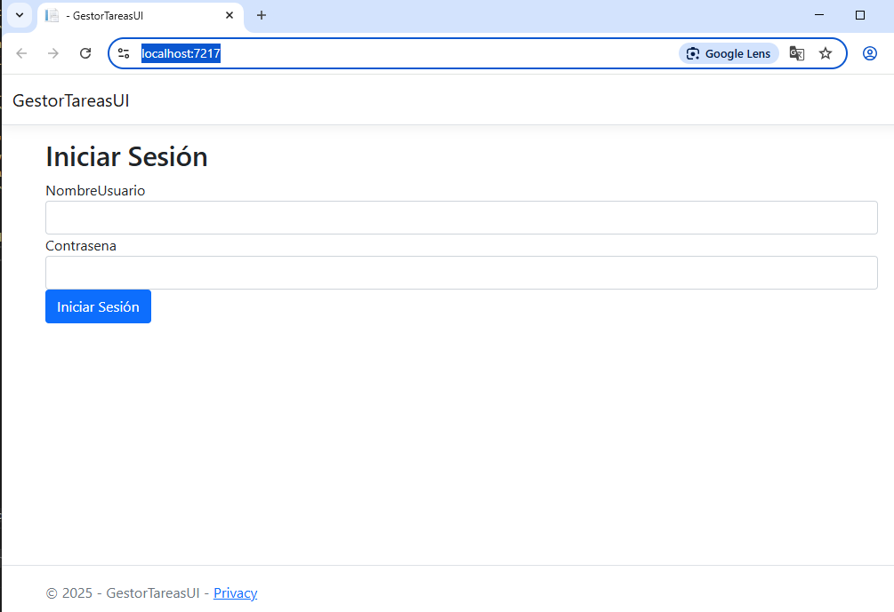
    Página Inicio que lista todas las tareas  muestra las opciones a realizar:
      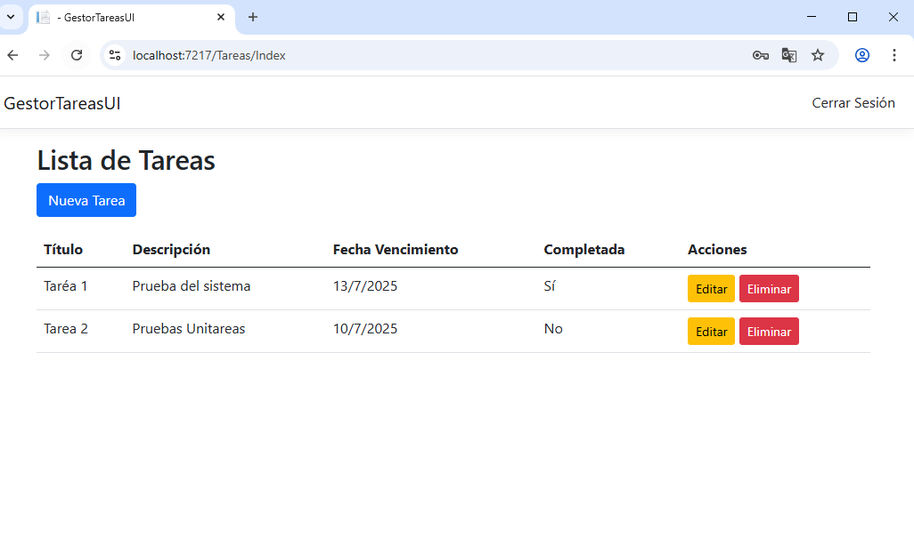
    Creación de una Tarea:
      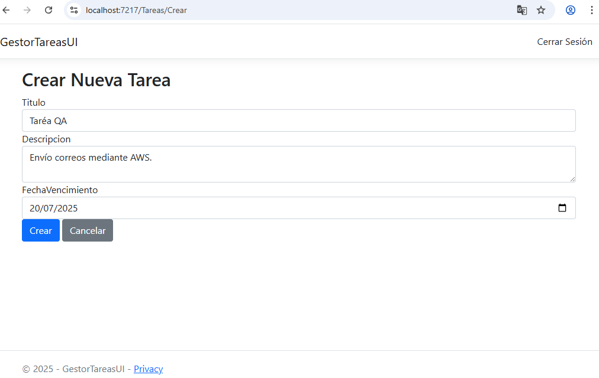 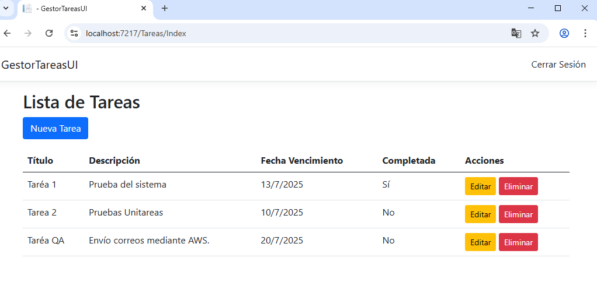
    Edición de una Tarea: 
     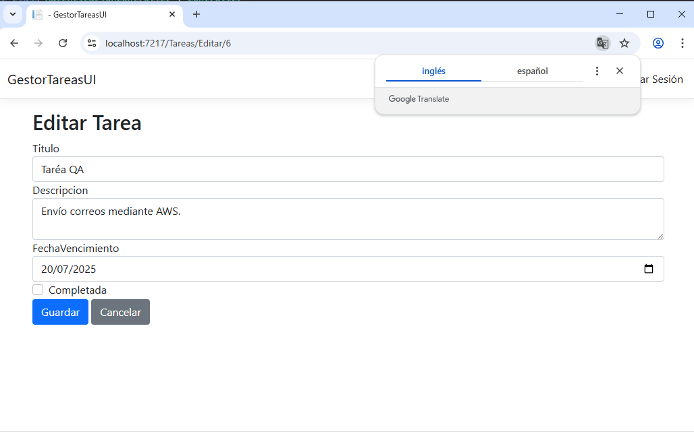 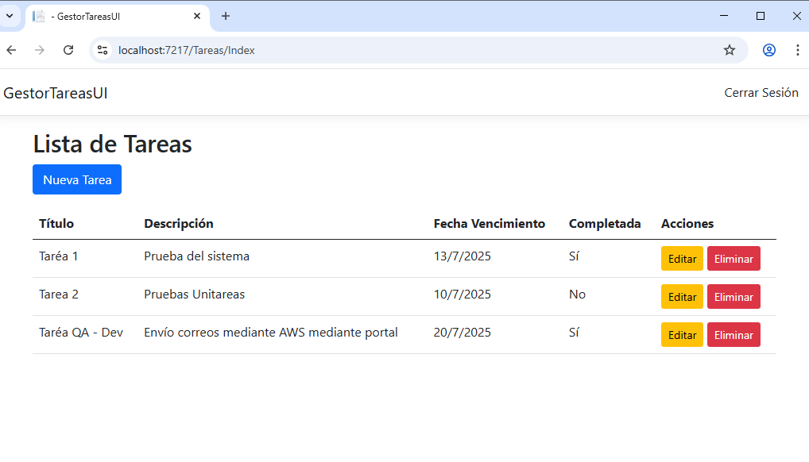
    Eliminación de la Tarea: 
     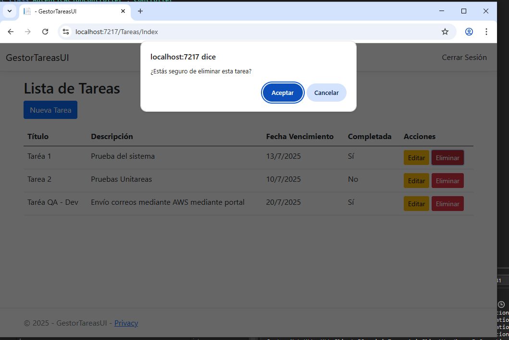 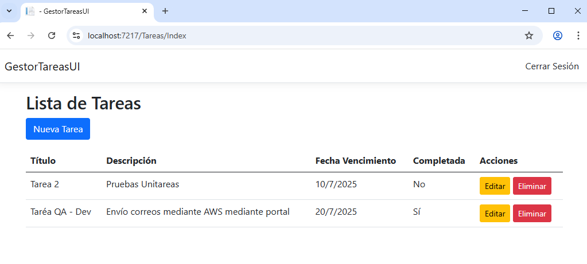
    

  